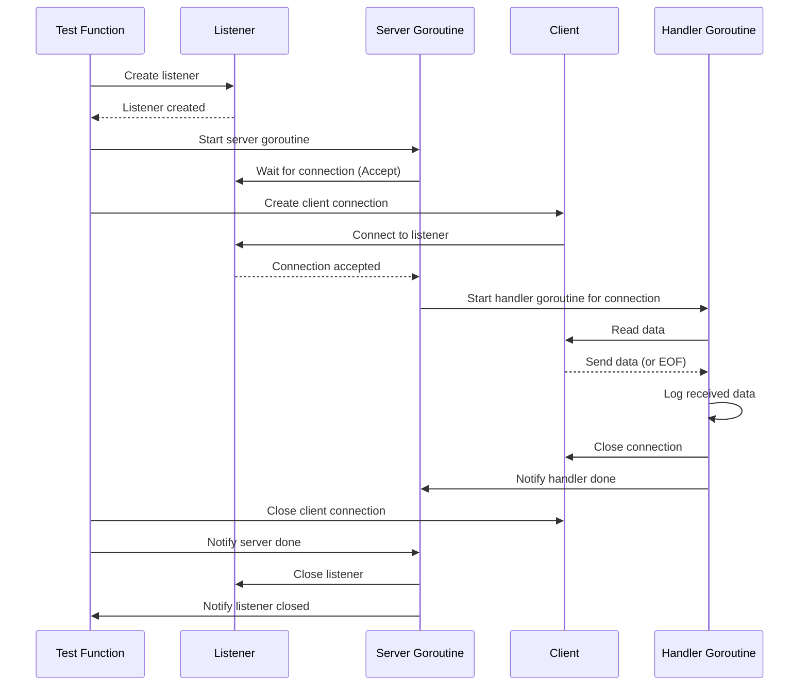

### TCP를 신뢰성 있게 만드는 것

흐름제어와 재전송을 통해 패킷 손실과 순서 문제를 해결하였음. 
- 흐름 제어 → 패킷 손실 문제 해결
- 재전송 → 패킷의 순차적 순서 보장

### TCP 세션 사용

세션을 통해 데이터 크기에 관계없이 스트림으로 전송할 수 있다. 

## TCP 연결 수립/해제 과정

- 3 way handshake를 통해 SYN → ACK를 주고 받으며 연결을 수립한다.
- 각 패킷을 수신하였음을 나타내기 위해 시퀀스 번호를 사용한다.
- `슬라이딩 윈도우` 방식을 통해 클라이언트/서버가 감당할 수 있을 수신 버퍼의 크기 미만의 데이터를 주고 받을 수 있다.
- 4 way handshake를 통해 FIN → ACK를 주고 받으며 연결을 해제한다.

### TCP 핸드셰이크를 통한 세션 수립

3웨이 핸드셰이크가 이뤄지면 TCP 세션이 생성되고, 데이터를 주고 받을 수 있게 된다. 

1. 클라이언트는 동기화(SYN) 플래그를 서버에 보낸다.

> 동기화 플래그는 서버에게 클라이언트의 정보와 이후 통신에서 사용할 슬라이딩 윈도 설정 값을 갖고 있다.

2. 서버는 승인(ACK) 플래그와 서버의 동기화 플래그를 클라이언트에게 보낸다.

> 승인 플래그는 정상적으로 동기화 플래그를 수신하였다는 정보를 갖고 있다.
서버의 동기화 플래그는 클라이언트가 보낸 동기화 플래그의 값 중에서 어떤 것을 사용할지 갖고 있다.

3. 클라이언트는 서버의 동기화 플래그를 승인하는 승인 플래그를 보낸다. 

### 시퀀스 번호를 사용한 패킷 수신 확인

핸드셰이크 과정에 시퀀스 번호를 포함하여 서버에 전송하는데, 이를 통해 시퀀스 번호가 승인되지 않은 경우에 대처할 수 있다. 

### 수신 버퍼와 슬라이드 윈도 크기

수신자는 승인 플래그를 보내기 전에 공간 가용량을 확인해야 하는데, 수신 데이터에서 사용하기 위해 예비해둔 공간을 **수신 버퍼**라고 한다. 

승인 플래그에는 윈도 크기 정보가 포함되는데, 이는 수신 확인 필요없이 전송할 수 있는 바이트 숫자를 말한다. 

### 세션 종료

양측의 연결 중 한 쪽에서 종료(FIN) 플래그를 보내면 승인 플래그가 답으로 오게 된다. 그리고 반대 편에서 FIN을 송신하고, ACK을 응답하여 세션이 종료된다. 

### 잘못된 세션 종료

TCP 연결을 갖고 있는 프로그램이 갑자기 종료되면, 아직 닫히지 않은 쪽에서는 초기화 플래그를 응답하여 더 이상 데이터를 수신할 수 없다는 것을 알린다. 

## 서버와 연결 수립



```
💡net package

Go 언어의 표준 라이브러리 중 하나로, low level의 network I/O(TCP/IP, UDP, domain name resolution, unix domain sockets 등)을 담당한다.

- Dial: server에 연결하는 데에 사용
- Listen : server 생성하는 데에 사용
```


listener에 특정 IP 주소와 포트 번호에 바인딩된다.
- `바인딩`: 운영체제가 지정된 IP 주소의 포트를 해당 리스너에게 단독으로 할당했다는 의미
- defer close를 통해 명시적인 프로그램 종료를 습관화하는 것이 좋다. → 메모리 누수나 데드록이 발생할 수도 있다.
  
```markdown
💡 defer listener.Close() 와의 차이

- **오류 처리:** 첫 번째 방법에서는 `listener.Close()`가 오류를 반환할 수 있으며, 이 오류를 처리하지 않으면 단순히 무시됩니다. 반면 두 번째 방법에서는 명시적으로 `_ = listener.Close()`를 통해 오류를 무시하고 있음을 나타냅니다. 이로 인해 코드를 읽는 사람에게 의도적으로 오류를 무시하고 있다는 것을 명확하게 전달할 수 있습니다.
- **유연성:** 클로저를 사용하면 추가적인 로직을 포함할 수 있는 유연성이 생깁니다. 예를 들어, 클로저 내부에서 로그를 출력하거나, 다른 클린업 작업을 함께 수행할 수 있습니다.
    위와 같이 클로저를 사용하면, `Close`가 실패했을 때 로그를 남기는 등의 추가 작업을 할 수 있습니다.
        
```
```markdown
💡 클로져

클로저는 **함수가 선언된 환경(scope)을 기억하고 접근할 수 있는 함수**를 의미합니다. 함수가 외부 스코프의 변수를 캡처(capture)하여 그 함수 내부에서 사용할 수 있게 만드는 것이 클로저의 핵심입니다.

### `defer func() { _ = listener.Close() }()`는 클로저인가?

- `defer func() { _ = listener.Close() }()` 코드에서 `func() { _ = listener.Close() }`는 익명 함수(anonymous function)입니다.
- 이 익명 함수는 `TestListener` 함수의 로컬 변수 `listener`에 접근하여 `listener.Close()`를 호출합니다.

이 함수는 **클로저입니다**. 그 이유는 이 익명 함수가 외부 스코프에 있는 `listener` 변수를 참조하고 있기 때문입니다. **클로저의 정의는 외부 변수에 접근하는 것 자체이지, 그 변수를 반환하는 것과는 관계가 없습니다**.
```

```markdown
💡고루틴

여러 코드를 통시에 실행하기 위해서 사용되는 가벼운 논리적/가상적 쓰레드

- go 키워드를 통해 함수를 호출하면 런타임 시 새로운 고루틴이 실행된다.
- 고루틴간의 통신은 Go 채널을 통해 관리한다.
```

### 타임아웃

Dial 함수를 사용하면 각 연결 시도의 타임아웃을 운영체제의 타임아웃 시간에 의존하게 된다. 
따라서, 코드 상에서 타임아웃을 구현해 각 연결마다의 기간을 처리하는게 좋다.

1. 인터페이스 구현체 net.Dialer의 Control 함수를 오버라이딩해서 구현
2. context를 통해 취소 시그널을 보냄(cancel 함수).
3. 데드라인 설정하기 

- 반환된 에러가 범용적이라 일시적인지 완전히 종료시켜야 할 에러인지 판단하기 어렵기 때문에 타입 `assertion을` 사용하여 타입을 명시적으로 나타내준다.
- Dial 함수의 각 `connection`의 타임아웃이 운영체제에 의존하지 않도록 하기 위해서는 코드 상에서 타임아웃을 제어해야 한다.
    - 연결마다 타임아웃 기간을 정의하여 사용할 수 있다.
    - context 패키지(취소 시그널을 보낼 수 있는 객체)를 사용하여 타임아웃을 구현할 수도 있다. → 좀 더 유연하다

## 데드라인

아무 패킷도 오고 가지 않은 채로 네트워크 연결이 얼마나 유휴 상태로 지속할 수 있는 지를 제어

→ 데드라인이 지나면 타임아웃 오류가 발생한다.

### 하트비트

> 네트워크 연결의 데드라인을 지속해서 뒤로 설정하기 위한 의도로 응답을 받기 위해 원격지로 보내는 메시지

클라이언트가 유후 상태에서 연결을 지속해야 하는 경우, 패킷을 계속 보내서 데드라인을 미룬다.


